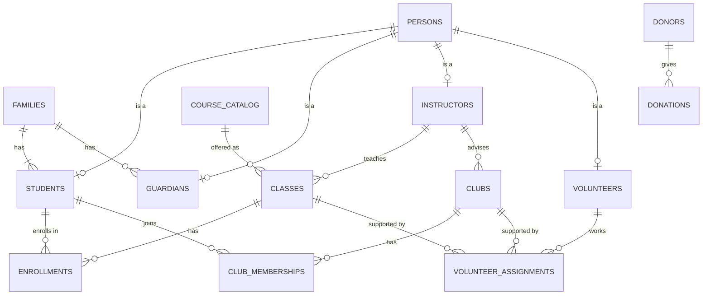
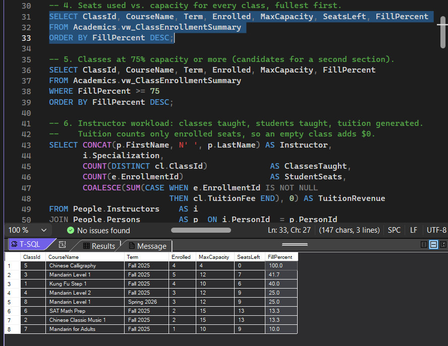
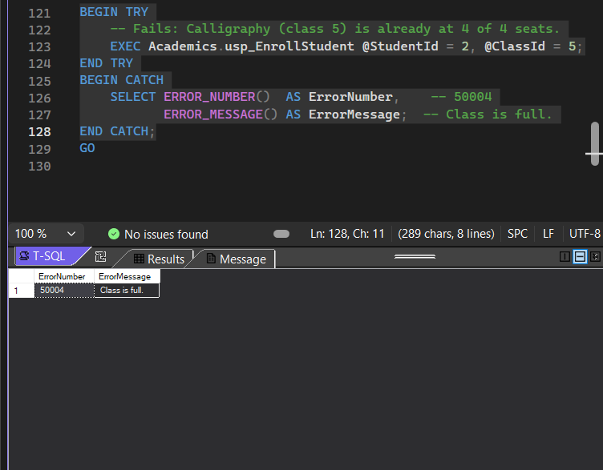
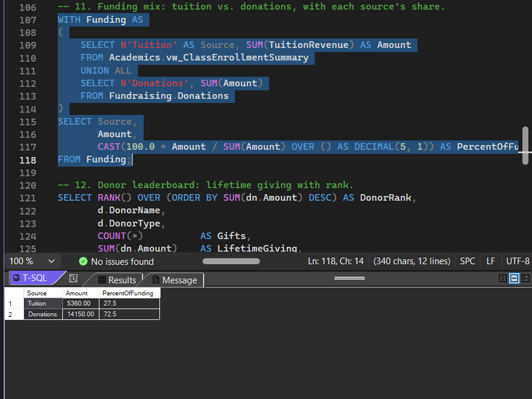
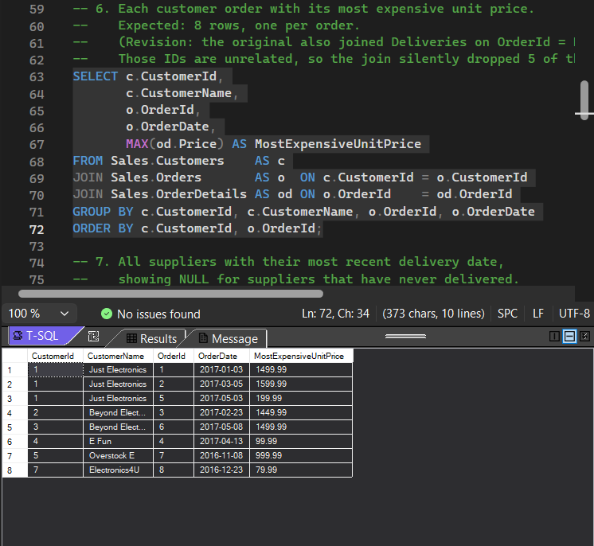
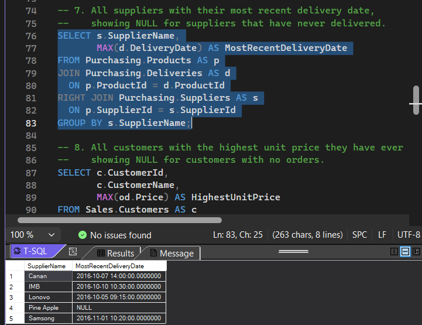
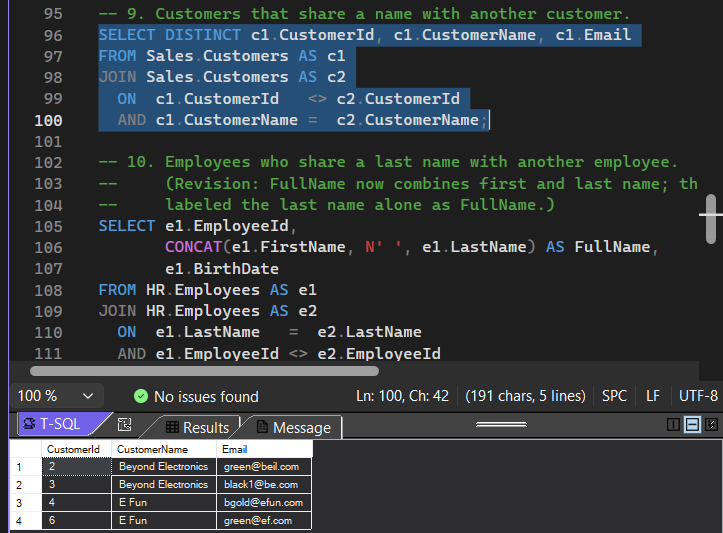

# SQL Server Database Design & Query Portfolio

**Damon Bly** · B.S. Computer Science student, Columbia College · [LinkedIn](https://www.linkedin.com/in/damon-bly-71866b385/) · [GitHub](https://github.com/dsbly1)

Two relational databases built in Microsoft SQL Server (T-SQL), developed from my CISS 202 Introduction to Databases coursework and extended into a complete project:

1. **[PLS School Database](pls-school-database/)** – a database I designed from scratch for a non-profit Chinese language school, taken from business rules to a working schema with constraints, views, a stored procedure, and reporting queries.
2. **[LifeStyle Sales Query Library](lifestyle-sales-queries/)** – 60+ queries against a wholesale electronics database, organized by skill from basic SELECT through joins and transactional data changes.
3. **[Design Exercises](design-exercises/)** – ERD and normalization exercises (many-to-many resolution, EER modeling, Third Normal Form).

## Highlights

| Area | What's in the repo |
| --- | --- |
| Data modeling | Business rules → conceptual ERD → logical ERD → physical schema; supertype/subtype (Person → Student, Guardian, Instructor, Volunteer); junction tables for every many-to-many relationship |
| Normalization | Schemas designed to Third Normal Form, with a worked 1NF → 3NF example |
| Integrity | Primary, foreign, unique, and CHECK constraints that enforce real business rules (e.g., classes can only be scheduled during open hours) |
| T-SQL | Filtering, string and date functions, aggregates with GROUP BY / HAVING, subqueries, inner/outer/self joins, CTEs, window functions |
| Programmability | Views, a stored procedure with TRY/CATCH, THROW, and row locking, and transactions with COMMIT/ROLLBACK |
| Indexing | Non-clustered indexes on the foreign keys that reports join on |

## PLS School Database at a glance



14 tables across 4 schemas (People, Academics, Activities, Fundraising). Full design notes: [pls-school-database/README.md](pls-school-database/README.md).

## How to run it

**Requirements:** SQL Server 2016 or later (the free LocalDB included with Visual Studio works), plus Visual Studio, SQL Server Management Studio, or `sqlcmd`.

Run each folder's scripts in numbered order. Every setup script drops and rebuilds its own database, so it is safe to re-run.

```powershell
# PLS school database
sqlcmd -S "(localdb)\MSSQLLocalDB" -i pls-school-database\01_create_database.sql
sqlcmd -S "(localdb)\MSSQLLocalDB" -i pls-school-database\02_seed_data.sql
sqlcmd -S "(localdb)\MSSQLLocalDB" -i pls-school-database\03_views_and_procedures.sql
sqlcmd -S "(localdb)\MSSQLLocalDB" -i pls-school-database\04_reporting_queries.sql

# LifeStyle database, then any query file
sqlcmd -S "(localdb)\MSSQLLocalDB" -i lifestyle-sales-queries\00_create_lifestyledb.sql
sqlcmd -S "(localdb)\MSSQLLocalDB" -i lifestyle-sales-queries\05_joins.sql
```

In Visual Studio: **View → SQL Server Object Explorer**, connect to `(localdb)\MSSQLLocalDB`, open a `.sql` file, and press **Ctrl+Shift+E** to execute.

## Sample output

**Enrollment capacity** – seats used vs. capacity for every PLS class, fullest first:



**Stored procedure** – `usp_EnrollStudent` refuses to overbook a full class:



**Funding mix** – tuition vs. donations using a CTE and a window function:



**Fixed join** – every order with its most expensive item (the original version dropped 5 of 8 orders):




**RIGHT JOIN** – every supplier with its latest delivery, including Pine Apple, which has never delivered (NULL):



**Self join** – customers that share a name with another customer:



## Reviewing my own work

Before publishing, I re-ran every assignment against a fresh database and fixed the bugs I found. Each fix is marked `(Revision: ...)` in the code. A few examples:

- A join matched `OrderId` to `DeliveryId`, two unrelated keys, and silently dropped 5 of 8 orders.
- A filter compared `DeliveryId < 100` where it meant `Price < 100`.
- A missing pair of parentheses let `AND`/`OR` precedence return the wrong rows.
- An `UPDATE ... WHERE CustomerId > 3` touched 16 rows instead of 3. The rewrite tracks new rows by ID and runs inside a transaction.

## Course context

CISS 202 Introduction to Databases, Columbia College. Textbook: Scott, L. (2022). *Relational Database and SQL* (3rd ed.). The LifeStyleDB sample database is course-provided, and queries labeled "Example" follow the textbook's worked examples. The PLS design and build, the exercise solutions, and all revisions are my own work.
