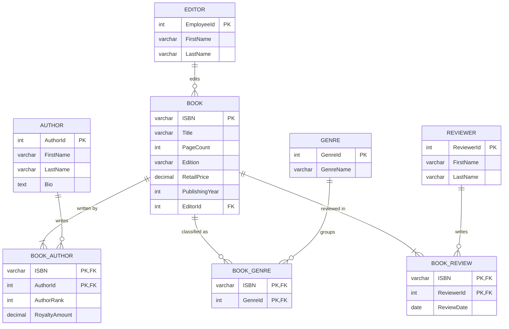
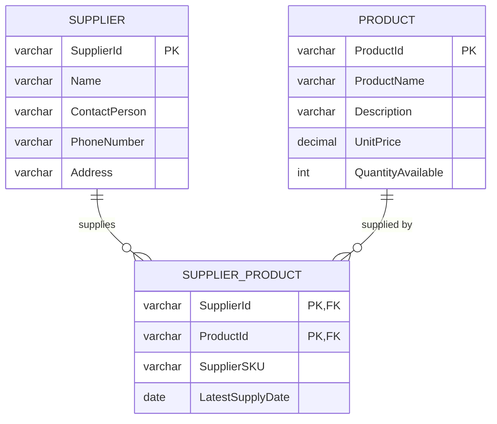
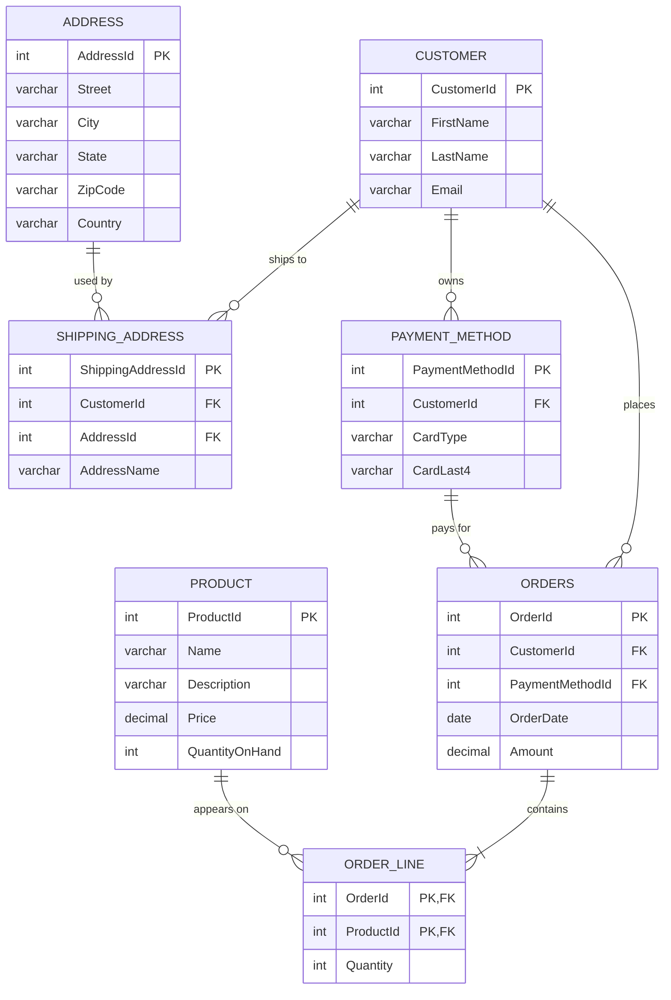

# Design Exercises

Smaller modeling exercises from CISS 202, redrawn as diagrams that render on GitHub. Each section notes what I would change today.

## 1. Small publisher: books and authors (ERD → EER)

**Requirements:** A book has an ISBN, title, author(s), page count, genre(s), edition, retail price, and publishing year. An author has an ID, first name, last name, and bio. Royalties are tracked per book-and-author pair (e.g., $100 for Book 1 / Author 1, $80 for Book 1 / Author 2). The enhanced version adds one employee editor per book and three to four volunteer reviewers per book.

**Business rules**

- Each book has a unique ISBN, a title, page count, edition, retail price, and publishing year.
- A book has at least one author; an author can write many books (many-to-many).
- A book can have many genres; a genre applies to many books (many-to-many).
- Each book has exactly one editor; an editor can edit many books.
- Each book has 3–4 reviewers; a reviewer can review many books.
- A royalty amount is recorded for each book–author pair.

**What I'd change from my original submissions**

- **Royalty moved into BOOK_AUTHOR.** My first version had a separate Royalty entity. A royalty is a fact about one book–author pair, so it belongs on the junction table.
- **ReviewDate moved off REVIEWER.** A reviewer reviews many books on different dates, so the date belongs to each review (BOOK_REVIEW), not to the person.
- **"Exactly 3–4 reviewers"** can't be enforced by a foreign key alone. In SQL Server it would need a stored procedure or trigger that counts reviews per book.

## 2. Suppliers and products (many-to-many with attributes)

Several suppliers can provide the same product, and each supplier provides many products. The junction table carries facts about the pairing itself: the supplier's own SKU and the latest supply date.

| SupplierId | ProductId | SupplierSKU | LatestSupplyDate |
| --- | --- | --- | --- |
| SUP_IBM | PROD_LAPTOP | IBM-TP-101 | 2025-08-01 |
| SUP_LNV | PROD_LAPTOP | LNV-TP-101 | 2025-08-15 |
| SUP_IBM | PROD_SERVER | IBM-P9-202 | 2025-07-20 |
| SUP_SSG | PROD_PHONE | SSG-GS25-303 | 2025-09-01 |

## 3. Customers, orders, and shipping addresses (final mapping)

Built in Excel as a step-by-step mapping exercise: identify entities, resolve many-to-many relationships, then map to tables. A customer can ship to several addresses, and one address can be shared, so `SHIPPING_ADDRESS` resolves Customer ↔ Address. Order ↔ Product resolves through `ORDER_LINE`.

*Note:* the original sheet stored a full card number. A real system should store only a token and the last four digits.

## 4. Normalizing to Third Normal Form

**Starting point (not even 1NF):** one row per employee, with several jobs crammed into single cells.

| EmployeeId | FirstName | LastName | DateHired | JobID | JobTitle |
| --- | --- | --- | --- | --- | --- |
| 111123 | Alice | Smith | 7/15/2019 | 999, 888 | Developer, Scrum master |
| 112123 | Tom | Scott | 2/14/2015 | 888, 111, 100 | Scrum master, CTO, COO |

**Problems:** JobID and JobTitle hold lists (violates 1NF). JobTitle depends on JobID, not on the employee (a transitive dependency, violates 3NF). Renaming a job title would mean editing many rows.

**Result in 3NF:** three tables, each fact stored once.

**Employees**

| EmployeeId (PK) | FirstName | LastName | DateHired |
| --- | --- | --- | --- |
| 111123 | Alice | Smith | 7/15/2019 |
| 112123 | Tom | Scott | 2/14/2015 |

**Jobs**

| JobID (PK) | JobTitle |
| --- | --- |
| 999 | Developer |
| 888 | Scrum master |
| 111 | CTO |
| 100 | COO |

**EmployeeJobHistory** (PK = EmployeeId + JobID + FromDate)

| EmployeeId (FK) | JobID (FK) | FromDate | ToDate |
| --- | --- | --- | --- |
| 111123 | 999 | 7/2019 | 6/2020 |
| 111123 | 888 | 6/2020 | (current) |
| 112123 | 888 | 2/2015 | 10/2018 |
| 112123 | 111 | 10/2018 | 2/2020 |
| 112123 | 100 | 3/2020 | (current) |

A NULL `ToDate` marks the current job, and including FromDate in the key allows an employee to hold the same job twice at different times.
