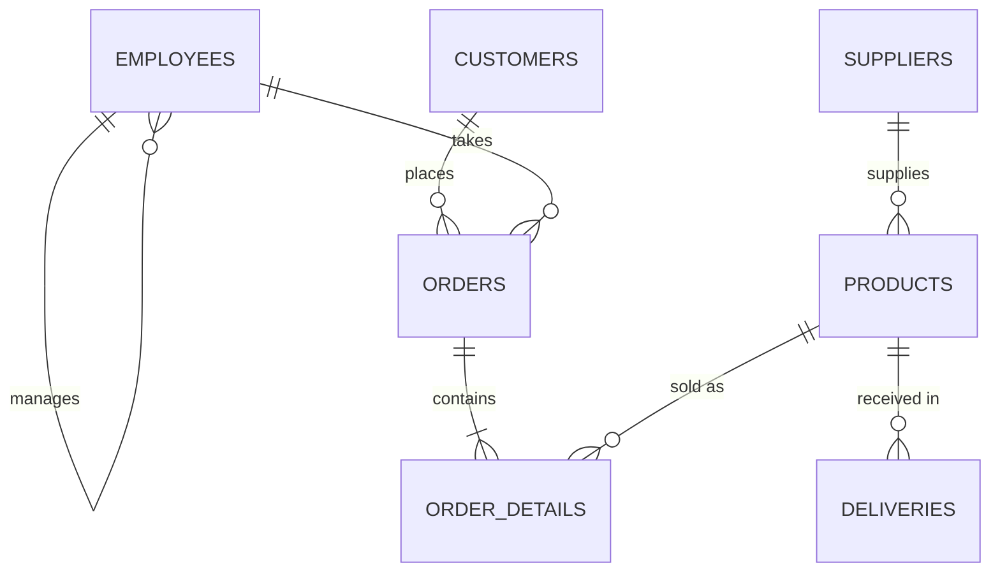

# LifeStyle Sales Query Library

63 T-SQL queries against **LifeStyleDB**, a sample database for LifeStyle LLC, an electronics wholesaler that buys from suppliers and sells to retail customers. The files build in difficulty from single-table SELECTs to multi-table joins and transactional data changes.

## Schema

Three schemas: **Sales** (Customers, Orders, OrderDetails), **HR** (Employees, with a self-referencing manager key), and **Purchasing** (Suppliers, Products, Deliveries).

## Files

| File | Skills | Queries |
| --- | --- | --- |
| [00_create_lifestyledb.sql](00_create_lifestyledb.sql) | Setup: builds and loads the database | – |
| [01_select_and_sort.sql](01_select_and_sort.sql) | SELECT, DISTINCT, ORDER BY, TOP | 10 |
| [02_filtering.sql](02_filtering.sql) | WHERE, BETWEEN, IN, IS NULL, AND/OR precedence | 11 |
| [03_functions_and_expressions.sql](03_functions_and_expressions.sql) | LIKE, calculated columns, SUBSTRING, CHARINDEX, DATEDIFF | 10 |
| [04_aggregates_and_grouping.sql](04_aggregates_and_grouping.sql) | SUM, AVG, MAX, GROUP BY, HAVING, subqueries | 10 |
| [05_joins.sql](05_joins.sql) | INNER, multi-table, LEFT, RIGHT, and self joins | 12 |
| [06_data_modification.sql](06_data_modification.sql) | INSERT, UPDATE, DELETE, variables, transactions | 10 |

Each query starts with the business question it answers. Labels like `(Example 5.13)` and `(Exercise 5.13)` refer to the textbook section; Examples follow the book's worked solutions, and Exercises are my own.

## Revision log

I re-ran every assignment against a fresh copy of the database before publishing. These are the bugs I found and fixed:

| File | Query | Problem | Fix |
| --- | --- | --- | --- |
| 01 | 4 | Read employees from HR.Employees, listing everyone | Read from Sales.Orders, where sales are recorded |
| 01 | 8 | "Three most recent" returned all deliveries | Added `TOP (3)` |
| 02 | 6 | `<= '2016-10-09'` missed deliveries later that day | Half-open range `< '20161010'` |
| 02 | 9 | Missing parentheses: AND ran before OR | `Quantity > 1 AND (Price < 100 OR Price > 1000)` |
| 02 | 10 | Compared `DeliveryId < 100` instead of price | `Price < 100` |
| 03 | 6 | Calculated the discount amount, not the discounted price | `Price * 0.80` |
| 04 | 2 | Hard-coded arithmetic instead of querying | `SUM(Quantity * Price)` over the table |
| 04 | 10 | Ignored the delivery-date condition | Subquery on Deliveries filtered by date |
| 05 | 4 | Duplicated the supplier report from query 3 | Rewrote as customers → orders → line items |
| 05 | 6 | Joined `OrderId = DeliveryId`; dropped 5 of 8 orders | Removed the unrelated join |
| 05 | 10 | "FullName" showed only the last name | `CONCAT(FirstName, ' ', LastName)` |
| 06 | 5–10 | `WHERE CustomerId > 3` updated 16 rows; filters used contact names | Track new IDs in variables; run in a transaction with ROLLBACK |
