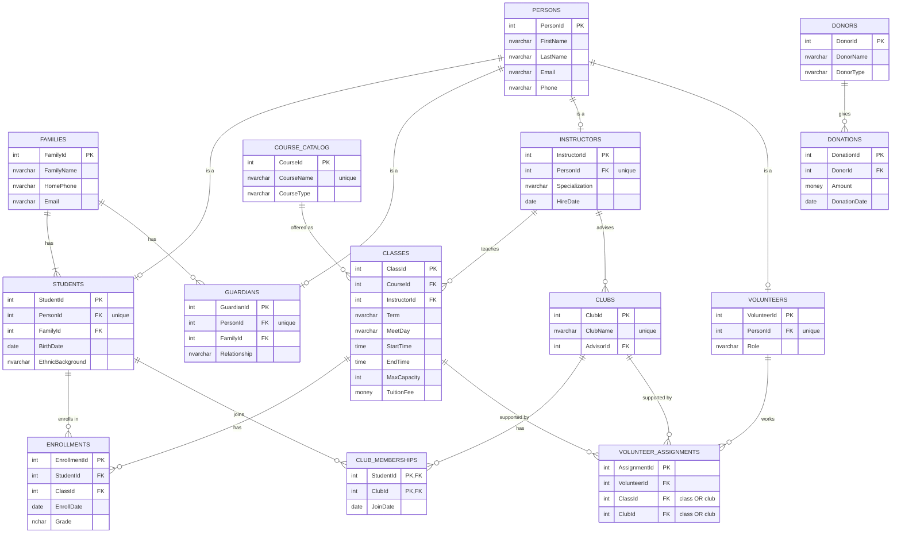

# PLS School Database

A SQL Server database for **PLS**, a non-profit school teaching Chinese language, arts, and culture. This was the case study for CISS 202; I took it from business rules through a logical ERD to a working, constraint-enforced physical schema.

| File | What it does |
| --- | --- |
| [01_create_database.sql](01_create_database.sql) | Creates the database, 4 schemas, 14 tables, constraints, and indexes |
| [02_seed_data.sql](02_seed_data.sql) | Loads sample families, students, classes, clubs, and donations |
| [03_views_and_procedures.sql](03_views_and_procedures.sql) | Two reporting views and an enrollment stored procedure, with tests |
| [04_reporting_queries.sql](04_reporting_queries.sql) | 13 business questions answered in T-SQL |

## 1. Business rules (from the case study)

- **Mission:** education in Chinese language, arts, and culture for students of all ages and ethnic backgrounds; most students are children aged 5–15.
- **Hours:** weekends 10:00am–7:00pm; selected weekday evenings 5:00pm–7:00pm.
- **Programs:** 50+ language classes a year, 100+ courses in arts/culture, sports, math, college prep, and specialty training, plus clubs.
- **Funding:** tuition, plus donations from individuals, private businesses, and institutions.
- **Support:** activities are supported by volunteers.

## 2. How the design evolved

| Stage | Result |
| --- | --- |
| First relational schema | Student, Class, Course, Club, Volunteer, and Donation tables, each holding a single `student_id` foreign key |
| Problem found | One `student_id` per class row means a class could only ever hold **one** student. Student–Class and Student–Club are many-to-many. |
| Logical ERD | Added **Enrollment** and **Membership** junction tables, a **Person** supertype so name/email/phone are stored once, a **Course Catalog** separate from scheduled **Classes**, and a **Donor** entity separate from **Donation** |
| Physical build (this folder) | Combined my logical ERD with the case study's starter tables (Families, Guardians), then enforced the business rules with constraints |

## 3. Entity-relationship diagram

## 4. Business rules enforced in the schema

| Business rule | How the database enforces it |
| --- | --- |
| Open 10am–7pm weekends, 5pm–7pm weekday evenings | `CHK_Classes_OpenHours` rejects any class scheduled outside those hours |
| Course types: language, arts/culture, sports, math, college prep, specialty | `CHK_CourseCatalog_Type` limits CourseType to that list |
| Donors are individuals, businesses, or institutions | `CHK_Donors_Type` |
| A student can't enroll in the same class twice | `UQ_Enrollments_StudentClass` (unique on StudentId + ClassId) |
| A class can't exceed its capacity | `usp_EnrollStudent` checks seats inside a locked transaction (a CHECK constraint can't count other rows) |
| One person record per role | `UNIQUE (PersonId)` on each subtype table makes Person → role 1:1 |
| A volunteer assignment is for a class or a club | `CHK_VolunteerAssignments_Target` requires exactly one of the two |
| Donations, tuition, and capacity can't be negative | `CHECK (Amount > 0)`, `CHECK (TuitionFee >= 0)`, `CHECK (MaxCapacity > 0)` |

## 5. Normalization notes

- **1NF:** every column holds one value. Phone and email live on Persons; a family's shared contact details live on Families.
- **2NF:** junction tables carry only facts about the pair. JoinDate belongs to a membership, and Grade belongs to an enrollment, not to the student or the class.
- **3NF:** no non-key column depends on another non-key column. Donor name and type are stored once in Donors instead of being repeated on every donation, and course name and type live in CourseCatalog instead of on every class.

## 6. Sample reports

Results from the included sample data:

| Report | Result |
| --- | --- |
| Fullest class | Chinese Calligraphy, 4 of 4 seats (100%) |
| Busiest instructor | Mei Wang: 4 classes, 12 student seats, $2,900 tuition |
| Students in no club | Mateo Garcia, Robert Miller |
| Largest donor type | Institutions: 2 gifts, $9,000 total |
| Funding mix | Donations $14,150 (72.5%), tuition $5,360 (27.5%) |
